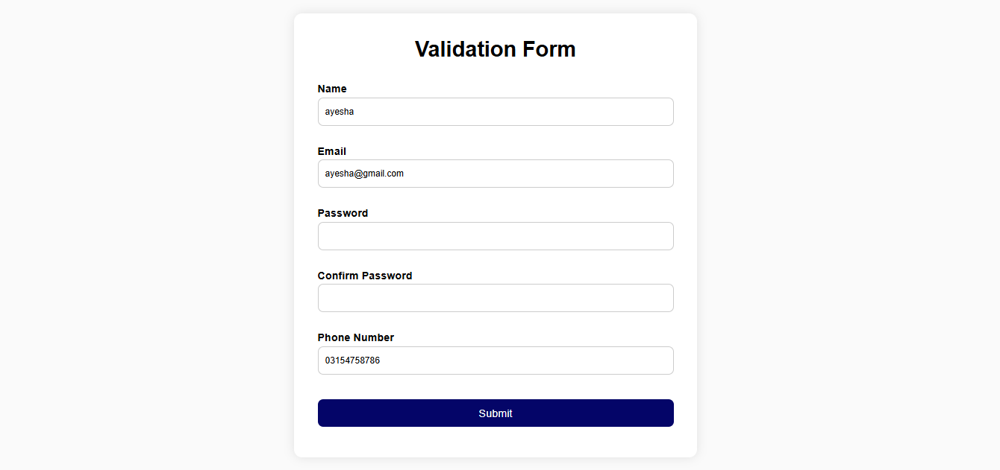

# ✅ Validation Form Project

A simple **client-side form validation project** built using **HTML, CSS, and JavaScript**.  
It checks user input using validation rules like regex and shows real-time error messages.

---

## 🚀 Features

- Name validation (only letters allowed)
- Email format validation
- Password strength check
- Confirm password matching
- Phone number validation
- Error messages for each field
- Success message on correct submission
- Saves user data in **localStorage**
- Data stays even after page reload

---

## 🛠️ Technologies Used

- HTML5
- CSS3
- JavaScript (Vanilla JS)

---

## 📂 Project Structure
project-folder/
│
├── index.html
├── style.css
├── script.js
└── image.png 

---

## ⚙️ How It Works

1. User fills the form fields
2. JavaScript validates input using regex rules
3. If any input is wrong → error message is shown
4. If all inputs are correct:
   - Data is stored in localStorage
   - Success message is shown
   - Form resets automatically

---

## 💾 Local Storage Feature

This project stores user data in browser storage:

- Data is saved using `localStorage.setItem()`
- Data is retrieved using `localStorage.getItem()`
- Data remains available even after page refresh

---

## 📸 Preview

---

## 🎯 Learning Outcomes

- DOM manipulation
- Form validation using JavaScript
- Regex basics
- Event handling
- LocalStorage usage
- Basic accessibility (ARIA support)

---

## 👨‍💻 Author

Made by: Ayesha Faqeer Hussain

---

## 📌 Note

This project is built for learning purposes to improve JavaScript fundamentals and frontend development skills.